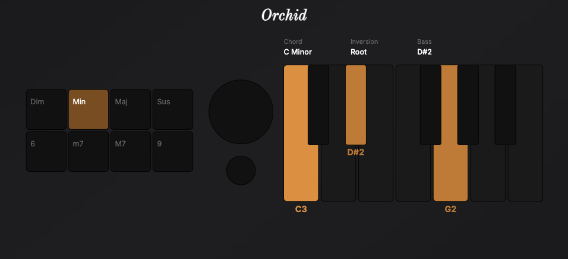

# Orchid Visualizer

**Orchid Visualizer** is an open-source community project designed to enhance your experience with the [Telepathic Instruments Orchid](https://telepathicinstruments.com/). This tool helps you explore and visualize the capabilities of this amazing device, making it easier to interact with and understand its features.  

### Try it out: [https://orchid.synthsonic.app](https://orchid.synthsonic.app)


### 

[](https://opensource.org/licenses/MIT)

## 🌟 Features

### Virtual Keyboard Display
Highlights the notes and chords pressed on your keyboard, providing a clear, real-time visual representation.

### Chord Quality Identification:

Detects and highlights the specific chord quality being played (e.g., minor, major, diminished).
### Detailed Chord Information

Displays comprehensive text details including:
* Chord Name: e.g., C minor
* Inversion: e.g., Root, First, or Second
* Bass Note and Octave: e.g., D1

### Voicing Numbers Page:

Offers a separate view where users can explore all voicing numbers used by the synth. This page includes:
* Tabs for different chord qualities (Dim, Min, Maj, and Sus)
* A breakdown of each voicing with the corresponding notes


## 🚀 Tech Stack
- [T3 Stack](https://create.t3.gg/)
    - [Next.js](https://nextjs.org) - React framework for production
    - [TypeScript](https://www.typescriptlang.org/) - Type safety
    - [Tailwind CSS](https://tailwindcss.com) - Utility-first CSS framework

## 📋 Prerequisites

- Docker (recommended)
- Node.js 18.x or later (alternative)
- npm 10.x or later (alternative)

## 🛠️ Getting Started

### 🐳 Docker Development (Recommended)

We recommend using Docker for development to ensure a consistent environment across all platforms:

1. Clone the repository
```bash
git clone https://github.com/SynthSonic/orchid-visualizer.git
cd orchid
```

2. Build and start the Docker container
```bash
docker-compose up
```

The application will be available at `http://localhost:3000`. Any changes to your code will automatically be reflected in real-time thanks to the configured hot reloading.

To stop the container:
```bash
docker-compose down
```

#### Docker Commands

```bash
docker-compose up            # Start the development environment
docker-compose up --build    # Rebuild and start (use after package.json changes)
docker-compose down          # Stop the development environment
docker exec -it orchid-visualizer npm run lint        # Run linting inside the container
docker exec -it orchid-visualizer npm run typecheck   # Run type checking inside the container
docker exec -it orchid-visualizer npm run format:check   # Run type checking inside the container
```

### Alternative: Standard Installation

If you prefer not to use Docker, you can set up the project directly on your system:

1. Clone the repository
```bash
git clone https://github.com/yourusername/orchid.git
cd orchid
```

2. Install dependencies
```bash
npm install
```

3. Copy the example environment file
```bash
cp .env.example .env
```

4. Update the environment variables in `.env` with your values

5. Start the development server
```bash
npm run dev
```

The application will be available at `http://localhost:3000`

## 🧪 Running Tests

```bash
npm run typecheck    # Run TypeScript checks
npm run lint        # Run ESLint
npm run format:check # Check code formatting
```

## 🚀 Deployment
This project is automatically deployed using [Vercel](https://vercel.com) when changes are merged into the `main` branch.


## 👥 Contributing

We welcome contributions! Please see our [Contributing Guide](CONTRIBUTING.md) for details on how to submit pull requests, report issues, and contribute to the project.


##  Telepathic Instruments Community Discord
Join us here: [](https://discord.gg/m23GeqeS8D)

## 📄 License

This project is licensed under the MIT License - see the [LICENSE](LICENSE) file for details.

## 🙏 Acknowledgments

- [T3 Stack](https://create.t3.gg/) for the amazing application stack
- All our contributors and supporters
